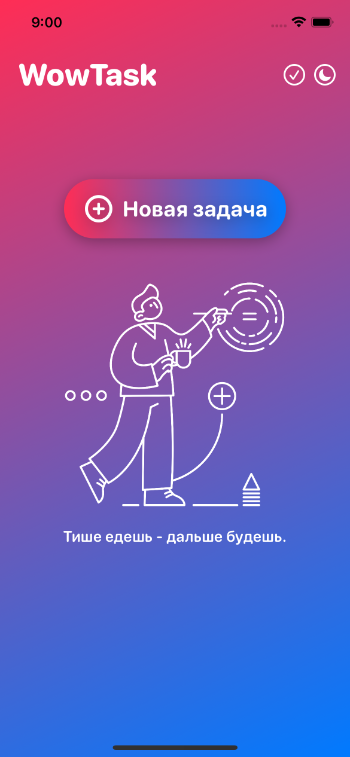
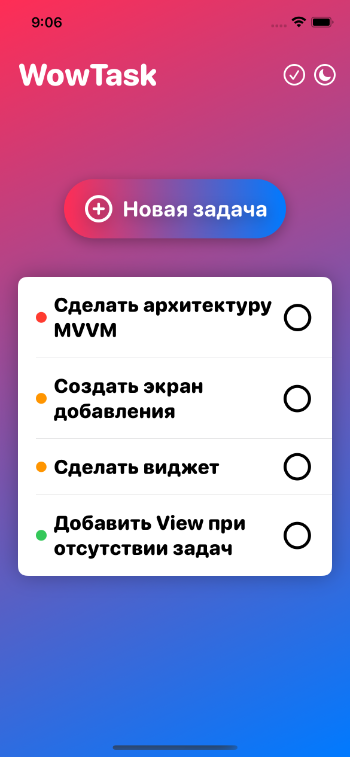
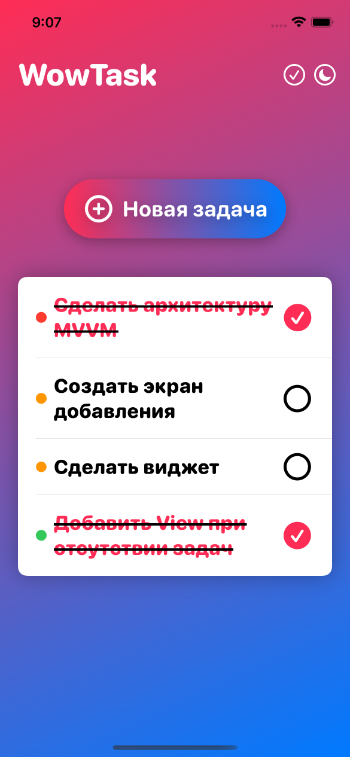
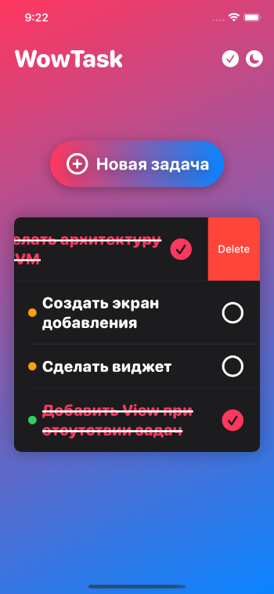
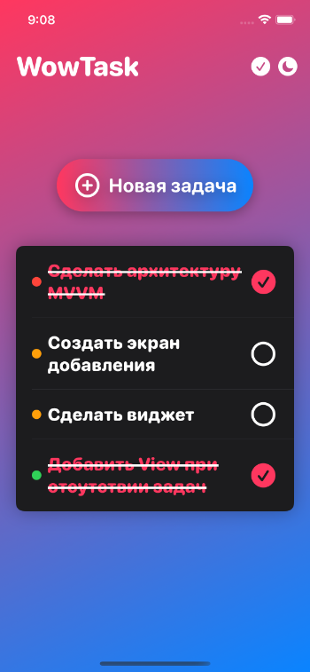

# WowTask
Приложение для ведения списка задач пользователя.

 

## Особенности приложения
 - использование фреймворка SwiftUI;
 - архитектура MVVM;
 - хранение данных в Core Data;
 - отдельное отображение выполненных задач;
 - отображение заглушки при отстутствии задач;
 - сортировка задач по приоритету;
 - ночной режим.
## Функционал приложения
### Создание задач
Пользователь может создать задачу с использованием приоритета.

 

### Отображение задач
Задачи отображаются на главном экране и сортируются по приоритету.

 

Выполненные задачи отображаются по нажатию на специальную кнопку в верхнем правом углу.

 

### Удаление задач
По свайпу влево происходит удаление задачи из CoreData.

 

### Ночная тема
По нажатию на кнопку смены темы меняются оформления таблицы задач, а также экрана добавления задач.

 

 

